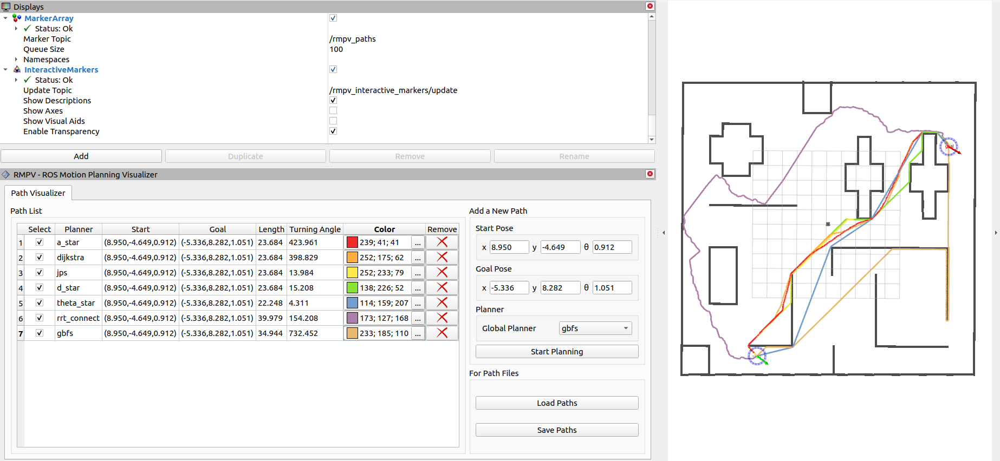

## Table of Contents
- [Introduction](#0)
- [File Tree](#1)
- [Start](#2)
- [UI Design](#3)
- [Examples](#4)
  - [Path Planning](#path-planning)
  - [Curve Generation](#curve-generation)
- [More](#5)


## <span id="0">0. Introduction

This repository provides ROS Motion Planning Visualizer (RMPV), a ROS-based visualization Rviz plugins for path planning and curve generation algorithms.

In scientific research, this repository allows researchers to observe, study, understand and analyze the working mechanisms of different algorithms, making it easier to identify strengths and weaknesses. This helps in the development of more efficient and optimized algorithms for various applications, such as robotics, transportation, and computer graphics.

This plugin is also one of tool chains of [ROS Motion Planning](https://github.com/ai-winter/ros_motion_planning) project.

## 1. <span id="1"> Start
RMPV depends on a complete ROS project. You can start by following the instructions in [ROS Motion Planning](https://github.com/ai-winter/ros_motion_planning).

## 2. <span id="2"> UI Design
`include/rmpv/ui_rmpv.h` is automatically generated by `uic`. To modify it, please modify `ui/rmpv.ui` with Qt Designer and run the following commands in your terminal.
```sh
cd ./src/rviz_plugins/rmpv
uic -o ./include/rmpv/ui_rmpv.h ./ui/rmpv.ui
```
## 3. <span id="3"> Documentation
Generating doxygen documentation helps you understand the code better.

First install doxygen and graphviz.
```sh
sudo apt-get install doxygen
sudo apt-get install graphviz
```
Then enter the root directory of project and run the following command in your terminal to generate doxygen documentation.
```sh
doxygen
```
Then you can find the documentation in `./docs/html/index.html`. You can configure the doxygen settings in `./Doxyfile`.
## 4. <span id="4"> Examples
### 4.1 Path Planning


### 4.2 Curve Generation
Under development.

## 5. <span id="5"> More

Our motion planning R&D toolkit:
* [ROS Motion Planning](https://github.com/ai-winter/ros_motion_planning)
  * [ROS Pedestrians Simulation](https://github.com/ai-winter/ros_pedestrians_simulation)
  * [ROS Motion Planning Visualizer](https://github.com/ai-winter/ros_motion_planning_visualizer)
* [Python Motion Planning](https://github.com/ai-winter/python_motion_planning)
* [Matlab Motion Planning](https://github.com/ai-winter/matlab_motion_planning)

Your stars, forks and PRs are welcome! Wishing you all the best in your research!