## Table of Contents
- [Introduction](#0)
- [File Tree](#1)
- [Configuration](#2)
- [Start](#3)
- [UI Design](#4)
- [Examples](#5)
- [More](#6)


# <span id="0">Introduction
This repository provides a ROS-based visualization Rviz plugins for path planning and curve generation algorithms.

In scientific research, this repository allows researchers to observe, study, understand and analyze the working mechanisms of different algorithms, making it easier to identify strengths and weaknesses. This helps in the development of more efficient and optimized algorithms for various applications, such as robotics, transportation, and computer graphics.


# <span id="1">File Tree
The file structure is shown below.
```
path_visualization_plugins
├── assets
└── src
    ├── planner
    │   ├── global_planner
    │   ├── local_planner
    │   └── utils
    ├── rviz_plugins
    │   └── path_visual_plugin
    ├── sim_env
    │   ├── config
    │   ├── launch
    │   ├── maps
    │   ├── rviz
    │   ├── scripts
    │   ├── urdf
    │   └── worlds
    └── third_party
        └── map_plugins

```

# <span id="2">Configuration
# <span id="3">Start
We provide a script to quickly start the world.
```sh
cd ./src/sim_env/scripts
./main.sh
```
<!-- -8.36 8.02 8.06 -7.44 -->
# <span id="4">UI Design
`include/ui_path_visual_plugin.h` is automatically generated by `uic`. To modify it, please modify `ui/path_visual_plugin.ui` with Qt Designer and run the following instructions in your terminal.
```sh
cd ./src/rviz_plugins/path_visual_plugin
uic -o ./include/ui_path_visual_plugin.h ./ui/path_visual_plugin.ui
```
# <span id="5">Examples
## Path Planning
|     Planner      |                                                                                             Version                                                                                              |                         Demo                          |
|:----------------:|:------------------------------------------------------------------------------------------------------------------------------------------------------------------------------------------------:|:----------------------------------------------------------:|
|     **GBFS**     |      [](https://github.com/ai-winter/path_visualization_plugins/blob/master/src/planner/global_planner/graph_planner/src/a_star.cpp)       |            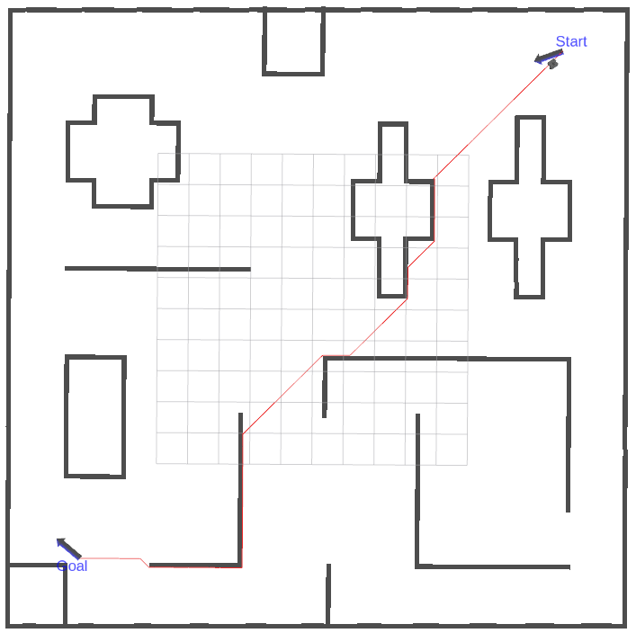            |
|   **Dijkstra**   |      [](https://github.com/ai-winter/path_visualization_plugins/blob/master/src/planner/global_planner/graph_planner/src/a_star.cpp)       |        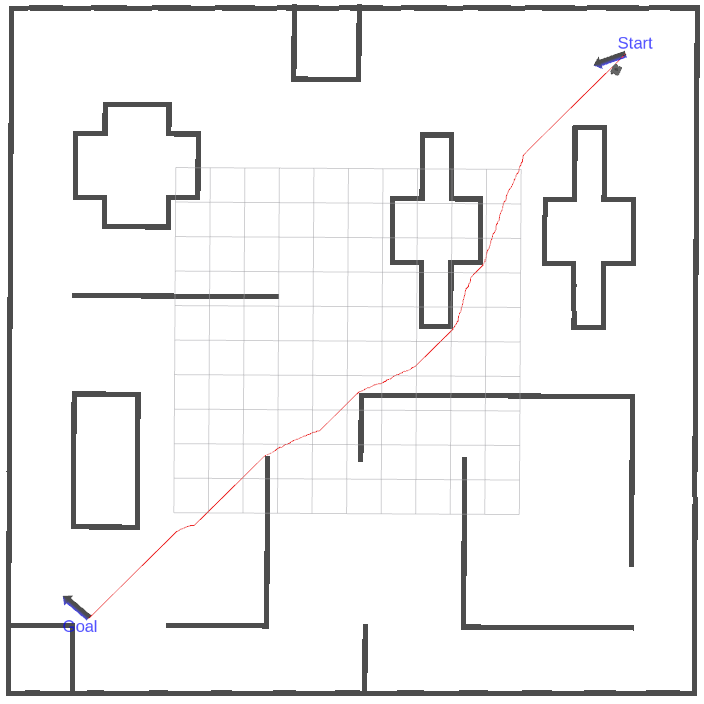        |
|     **A\***      |      [](https://github.com/ai-winter/path_visualization_plugins/blob/master/src/planner/global_planner/graph_planner/src/a_star.cpp)       |          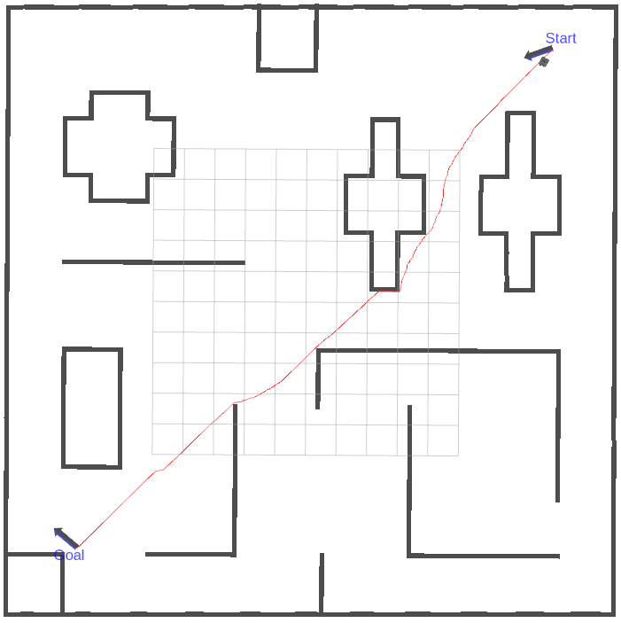          |
|     **JPS**      | [](https://github.com/ai-winter/path_visualization_plugins/blob/master/src/planner/global_planner/graph_planner/src/jump_point_search.cpp) |             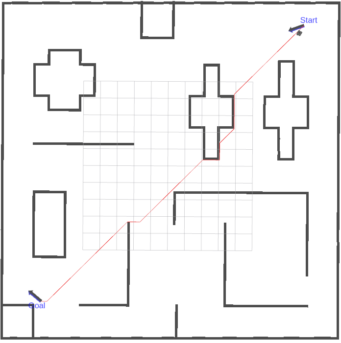             |
|     **D\***      |     []((https://github.com/ai-winter/path_visualization_plugins/blob/master/src/planner/global_planner/graph_planner/src/d_star.cpp))      |          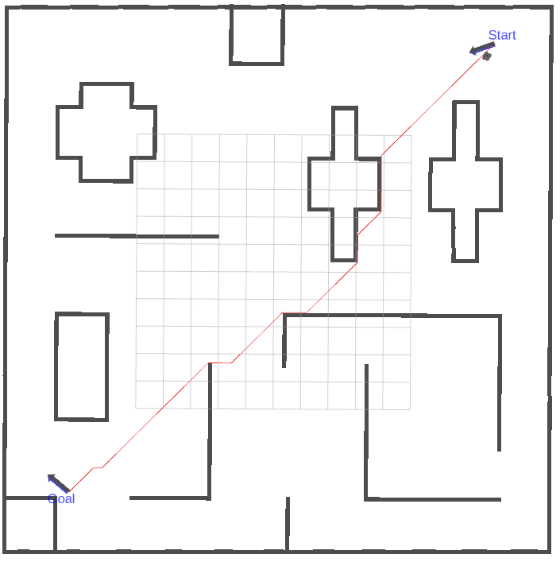          |
|    **LPA\***     |    []((https://github.com/ai-winter/path_visualization_plugins/blob/master/src/planner/global_planner/graph_planner/src/lpa_star.cpp))     |                |
|   **D\* Lite**   |   []((https://github.com/ai-winter/path_visualization_plugins/blob/master/src/planner/global_planner/graph_planner/src/d_star_lite.cpp))   |          |
|   **Voronoi**    |     []((https://github.com/ai-winter/path_visualization_plugins/blob/master/src/planner/global_planner/graph_planner/src/voronoi.cpp))     |         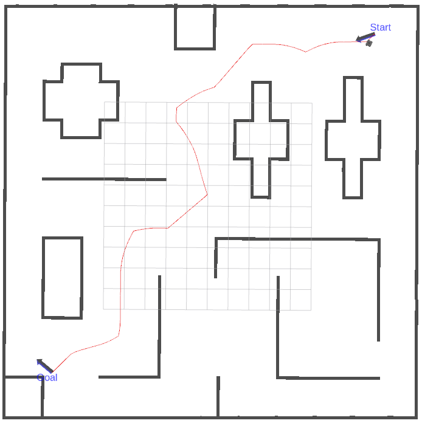         |
|   **Theta\***    |   []((https://github.com/ai-winter/path_visualization_plugins/blob/master/src/planner/global_planner/graph_planner/src/theta_star.cpp))    |      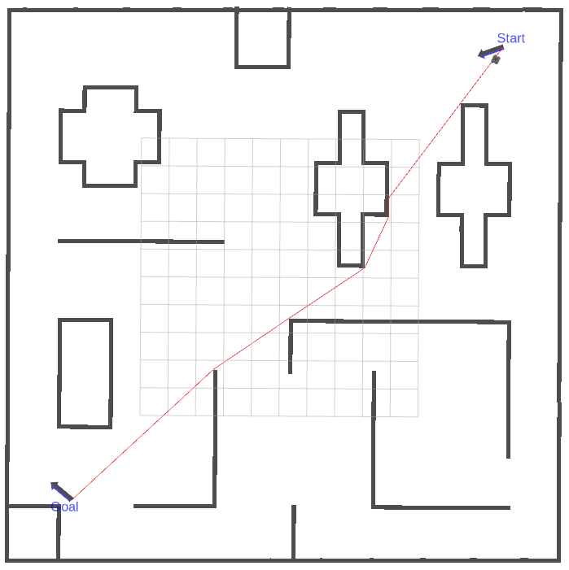      |
| **Lazy Theta\*** | []((https://github.com/ai-winter/path_visualization_plugins/blob/master/src/planner/global_planner/graph_planner/src/lazy_theta_star.cpp)) | 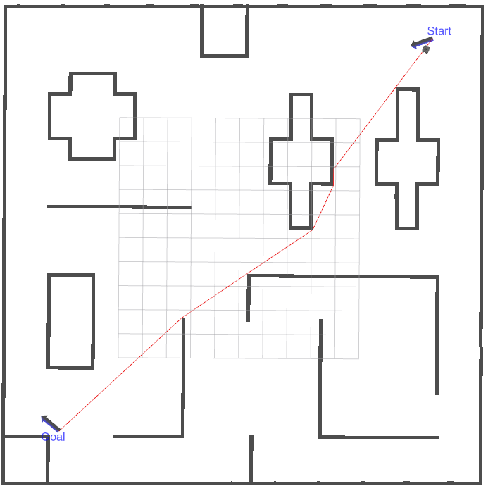 |
|     **RRT**      |       [](https://github.com/ai-winter/path_visualization_plugins/blob/master/src/planner/global_planner/sample_planner/src/rrt.cpp)        |             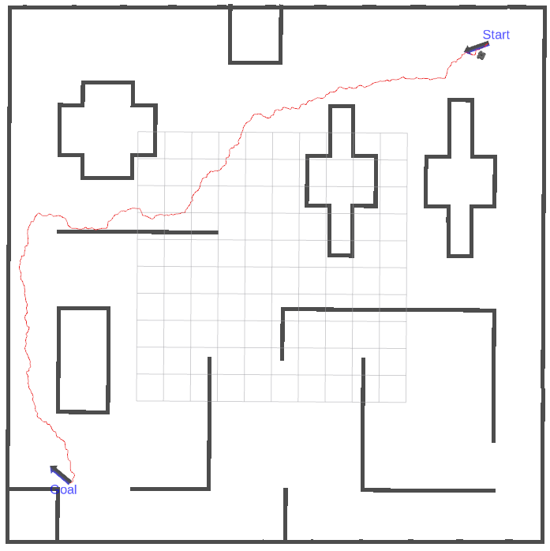             |
|    **RRT\***     |     [](https://github.com/ai-winter/path_visualization_plugins/blob/master/src/planner/global_planner/sample_planner/src/rrt_star.cpp)     |        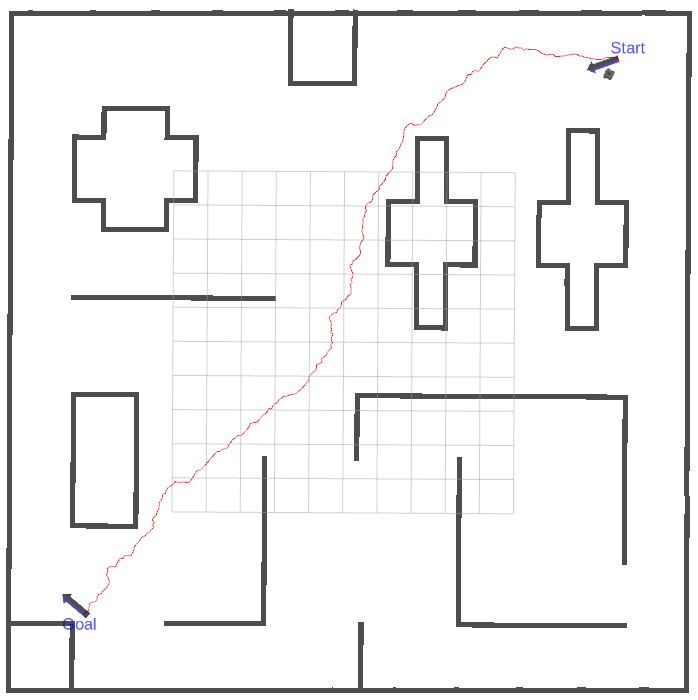        |
| **Informed RRT** |   [](https://github.com/ai-winter/path_visualization_plugins/blob/master/src/planner/global_planner/sample_planner/src/informed_rrt.cpp)   |    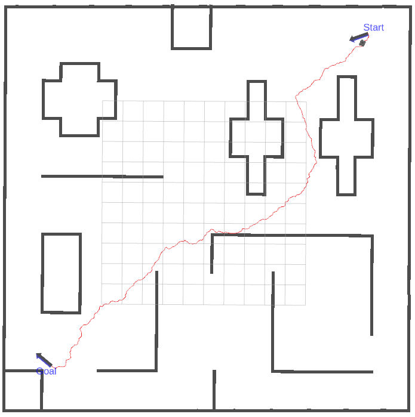    |
| **RRT-Connect**  |   [](https://github.com/ai-winter/path_visualization_plugins/blob/master/src/planner/global_planner/sample_planner/src/rrt_connect.cpp)    |     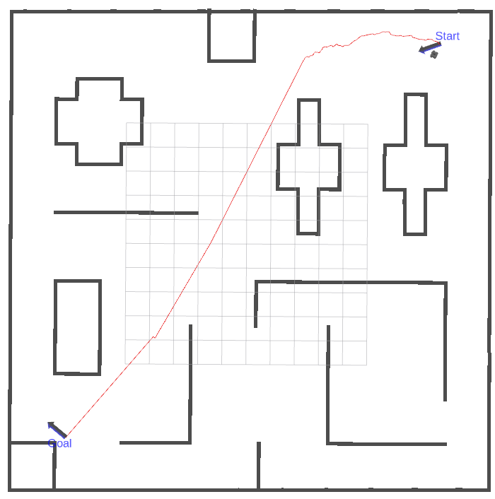     |

## Curve Generation

# <span id="6">More

More examples could be found at [https://github.com/ai-winter/path_visualization_plugins](https://github.com/ai-winter/path_visualization_plugins). 
